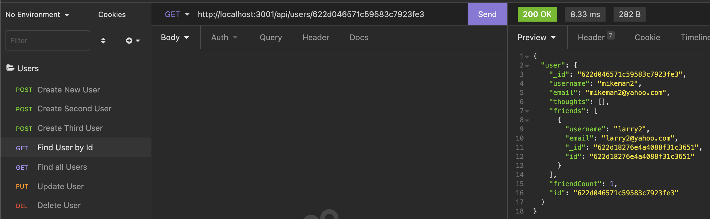
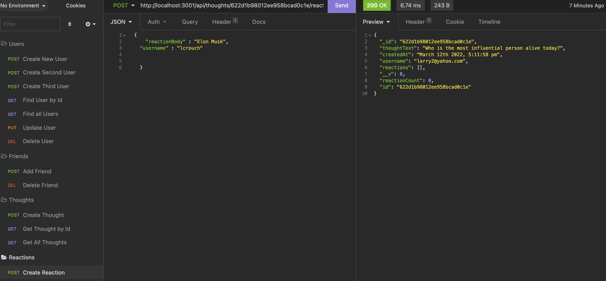
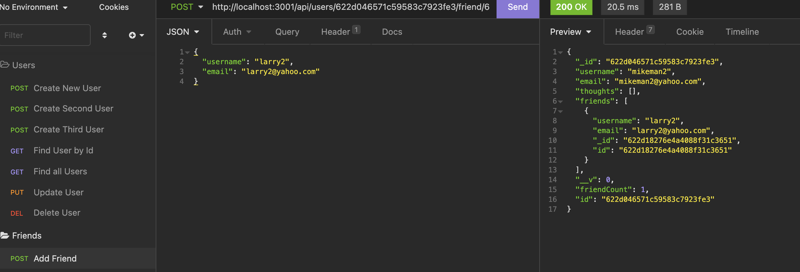

# social-network-api
  ##  
   
    

  ## Licensing:
  
  ## Table of Contents: 
  - [Description](#description)
  - [Technology](#technology)
  - [Installation](#installation)
  - [Usage](#usage)
  - [Questions](#questions)

  ## Description:
  an API for a social network web application where users can share their thoughts, react to friends’ thoughts, and create a friend list
  ## Technology:
  Express.js, MogoDB database, Mongoose ODM, Moment.js, Insomnia to test routes
  ## Installation: 
  In the terminal install the node package manager by typing nmp install.  Then type node index to start.   
  ## Usage: 
  When users invoke the applcaiton THEN the server is started and the Mongoose models are synched to the MongoDN database,WHEN I open API GET routes in Insomnia for users and thoughts THEN the data for each of these routes is displayed in a formatted JSON, WHEN I test API POST, PUT, and DELETE routes in Insomnia THEN I am able to successfully create, update, and delete users and thoughts in my database WHEN I test API POST and DELETE routes in Insomnia THEN I am able to successfully create and delete reactions to thoughts and add and remove friends to a user’s friend list 
  ## License: 
  None Provided 
  ## Questions: 
  lmc@uga.edu
  
  <https://github.com/tripledawg>